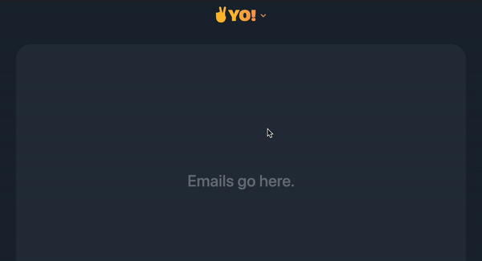

# YO!: A Faux Email Service

## Purpose
This is an exercise in uncovering Hotwire patterns by reverse-engineering
[HEY Email](https://hey.com/). The interface is decidedly similar to the actual
product. This is done in admiration, I am not affiliated with Basecamp.

## App Structure
Usually, my framework-of-choice is Ruby on Rails. In this case, I decided to
build this using node and express in the hope of keeping everything
as bare-bones as possible. We'll see how it goes.

This is modeled following MVC and heavily inspired by Rails.

## Running The App
1. Install dependencies with yarn or npm
1. Build with `npm run build`
1. Start server with `npm run start`
1. Navigate to [http://localhost:8080/](http://localhost:8080/)
